# 🧪 Python Code Obfuscation Benchmark

This project was developed as the final assignment of the **Computer and Information Engineering program at UFRJ (Federal University of Rio de Janeiro)**. Its goal is to benchmark Python code obfuscation tools by evaluating their impact on performance, memory usage, startup time, and final code size.

---

## 📌 Overview of the Benchmark Process

```mermaid
flowchart TD
    classDef header fill:#303F9F,color:white,stroke-width:0px,font-weight:bold,font-size:18px
    classDef mainFlow fill:#3F51B5,color:white,stroke-width:0px,font-weight:bold
    classDef toolBox fill:#00BCD4,color:white,stroke-width:0px
    classDef processBox fill:#FF9800,color:white,stroke-width:0px
    classDef metricBox fill:#4CAF50,color:white,stroke-width:0px
    classDef outputBox fill:#9C27B0,color:white,stroke-width:0px

    TITLE["PYTHON CODE OBFUSCATION<br>BENCHMARK"]:::header
    INPUT["PYTHON<br>SOURCE CODE"]:::mainFlow
    TOOLS["OBFUSCATION<br>TOOLS"]:::mainFlow
    BENCHMARK["BENCHMARK<br>PROCESS"]:::mainFlow
    METRICS["EVALUATED<br>METRICS"]:::mainFlow
    RESULTS["COMPARATIVE<br>ANALYSIS"]:::mainFlow

    TITLE --> INPUT --> TOOLS --> BENCHMARK --> METRICS --> RESULTS

    TOOLS --- ToolsGroup
    subgraph ToolsGroup [" "]
        direction TB
        T1["PyArmor<br><i>Advanced commercial<br>protection</i>"]:::toolBox
        T2["PyMinifier<br><i>Basic minification<br>and obfuscation</i>"]:::toolBox
        T3["Cython<br><i>Compilation to<br>C code</i>"]:::toolBox
        T4["PyInstaller<br><i>Executable<br>packaging</i>"]:::toolBox
        T5["PyObfuscate<br><i>Identifier<br>obfuscation</i>"]:::toolBox
        T1 --- T2 --- T3 --- T4 --- T5
    end

    BENCHMARK --- ProcessGroup
    subgraph ProcessGroup [" "]
        direction TB
        B1["1. Preparation<br><i>Tool installation and<br>dependency detection</i>"]:::processBox
        B2["2. Application<br><i>Obfuscation execution<br>on original code</i>"]:::processBox
        B3["3. Execution<br><i>Tests with multiple<br>controlled iterations</i>"]:::processBox
        B4["4. Monitoring<br><i>Continuous measurement of<br>resources and performance</i>"]:::processBox
        B1 --- B2 --- B3 --- B4
    end

    METRICS --- MetricsGroup
    subgraph MetricsGroup [" "]
        direction TB
        M1["⏱️ Execution<br>Time<br><i>(seconds)</i>"]:::metricBox
        M2["💾 Memory<br>Usage<br><i>(MB)</i>"]:::metricBox
        M3["📏 Code<br>Size<br><i>(KB)</i>"]:::metricBox
        M4["⚡ Startup<br>Time<br><i>(ms)</i>"]:::metricBox
        M1 --- M2 --- M3 --- M4
    end

    RESULTS --- ResultsGroup
    subgraph ResultsGroup [" "]
        direction TB
        R1["📊 Comparative<br>Graphs"]:::outputBox
        R2["📈 Statistical<br>Analysis"]:::outputBox
        R3["🌐 Interactive<br>HTML Dashboard"]:::outputBox
        R1 --- R2 --- R3
    end

    class ToolsGroup,ProcessGroup,MetricsGroup,ResultsGroup invisible
    classDef invisible fill:none,stroke:none
```



---

## 🚀 How to Run

### 1. Clone the repository

```bash
git clone https://github.com/your-user/python-obfuscation-benchmark.git
cd python-obfuscation-benchmark
```

### 2. Install dependencies

Set up a virtual environment:

```bash
python3 -m venv venv
source venv/bin/activate
pip install -r requirements.txt
```

> Some tools may need manual installation:  
`pip install pyarmor pyminifier cython pyinstaller`

### 3. Run the benchmark

```bash
python benchmark.py --test-files example.py -i 10 -o results/
```

---

## ⚙️ Command-line Options

| Flag | Description |
|------|-------------|
| `--test-files`, `-t` | Python source files to be tested |
| `--iterations`, `-i` | Number of runs per tool (default: 3) |
| `--output-dir`, `-o` | Directory to save results |
| `--disable-tools` | Comma-separated list of tools to skip |

---

## 🛠️ Supported Tools

- **Original**: Unmodified code (baseline)
- **PyArmor**: Advanced bytecode obfuscation
- **Pyminifier**: Basic minification and identifier obfuscation
- **Cython**: Code compilation to C
- **PyInstaller**: Packaging as standalone executables
- **PyObfuscate**: Obfuscation based on variable renaming

---

## 📂 Output Structure

The benchmark generates the following files:

- `summary.json`: Aggregated benchmark results
- `results.csv`: Tabular data for all runs
- `chart_*.png`: One chart per evaluated metric
- `plot.png`: Overview chart
- `report.html`: Interactive dashboard
- `system_info.csv`: Environment and system data

---

## 📈 Collected Metrics

- ⏱️ **execution_time** — runtime in seconds
- ⚡ **startup_time** — time to start the program
- 💾 **memory_usage** — memory peak in MB
- 📏 **code_size** — file size after obfuscation (KB)

---

## 🤝 Contributing

Feel free to open issues or submit pull requests to improve this benchmark, fix bugs, or add new tools. To add a new tool, define its configuration in the `TOOLS` dictionary in the script.

---

## 🧠 License

Distributed under the MIT License.

---

## 🌐 Versão em Português?

[Leia aqui a versão em Português do README](README.md)
